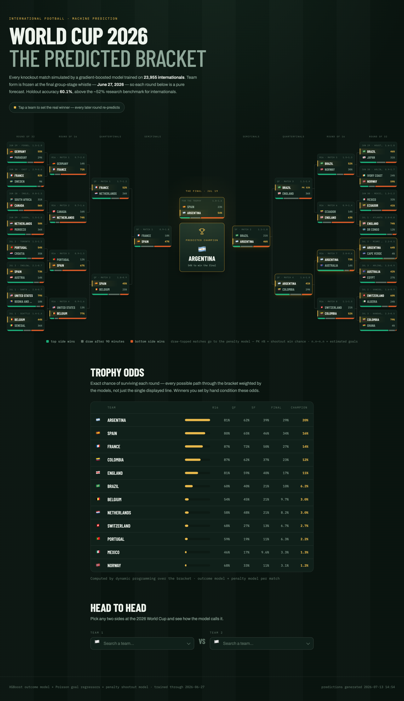

<h1 align="center">FIFA World Cup 2026 — Prediction Model</h1>

<p align="center">
  <em>An end-to-end pipeline that scrapes 26 years of international football, engineers
  leakage-free form features, and predicts every knockout match of the 2026 World Cup.</em>
</p>

<p align="center">
  
  
  
  
</p>

<p align="center">
  
</p>

---

## What this is

Most World Cup bracket predictors give you one path through the bracket and a champion. This one
gives you the **whole probability distribution**, and it is honest about how much it actually knows.

Three models work in tandem:

- an **outcome model** (XGBoost + Random Forest) that predicts Home / Draw / Away,
- a **penalty shootout model** that resolves matches the outcome model calls a draw,
- **Poisson goal regressors** for scorelines.

Knockout football has no draws, so a bracket needs both: `P(A advances) = P(A wins) + P(draw) × P(A wins shootout)`.
Those per-match probabilities are then folded into exact per-team round-reach odds by dynamic
programming over the bracket — every possible path weighted, not just the single displayed line.

Everything is frozen at **June 27, 2026**, the end of the group stage. No post-cutoff match touches
training, features, or inference, so every knockout prediction is a genuine forecast rather than
hindsight.

## Results

Evaluated on a **time-based** holdout — all 5,260 internationals from 2021-06-01 onward, never
shuffled, so no future form leaks backwards into training.

| | Accuracy | Log loss |
|---|---|---|
| Always predict home win | 48.1% | — |
| **Elo sign alone** | **60.5%** | — |
| Random Forest | 60.1% | — |
| XGBoost (uncalibrated) | 60.0% | 0.8752 |
| **XGBoost + temperature scaling** (T = 1.141) | **60.0%** | **0.8707** |

Two things worth being upfront about:

**The model currently ties an Elo-only baseline.** At 60.0% versus 60.5% for simply backing the
higher-Elo side, the form features are earning their keep in *calibration* but not yet in
*accuracy*. That gap is the single most interesting open problem in this repo, and it is what the
roadmap's feature-engineering work targets.

For scale, published ML benchmarks on soccer result prediction tend to cluster in the low 50s — the
best test-set accuracy in the 2017 Soccer Prediction Challenge was around 50.5%
([survey](https://arxiv.org/abs/2403.07669)). That is *not* a like-for-like comparison: the
challenge scored domestic league matches, and national-team football is the easier problem, because
the Elo gap between two countries is usually far wider than between two clubs in the same division.
Read it as context for what "good" looks like in this space, not as a leaderboard position.

**Draw recall is 7.3%, and that is correct.** Draws are 23.5% of matches but are almost never the
single most likely outcome, so a well-calibrated model rarely picks them outright. A model with high
draw recall on this data is usually a model with a leak.

### On that subject — this model used to report 87.9%

It was a data leak, and finding it is the reason the test suite exists. Pre-match rank was being
derived as `rank − rank_change`, but eloratings' `rank_change` column is *result-asymmetric*: zero on
93.4% of home losses, nonzero on 71.3% of home wins. Subtracting it smuggled the match result into a
"pre-match" feature.

| | Leaky | Clean |
|---|---|---|
| Accuracy | 87.9% | 60.1% |
| Log loss | 0.301 | 0.875 |
| Draw recall | 71.9% | 7.3% |

Pre-match Elo and rank are now carried forward from each team's *previous* match inside the history
loop, which is exactly what inference does. [`tests/test_no_leakage.py`](project-root/tests/test_no_leakage.py)
fails if anyone reintroduces a change-column subtraction.

## Quickstart

```bash
git clone https://github.com/caelwynder/FIFA-WC-Prediction-Model.git
cd FIFA-WC-Prediction-Model/project-root

python3.14 -m venv .venv
source .venv/bin/activate
pip install -r requirements.txt
```

Scrape fresh data and retrain everything in one command:

```bash
python scripts/run_full_pipeline.py
```

Then regenerate predictions and the site:

```bash
python scripts/02_team_fvector.py        # feature vectors for upcoming fixtures
python scripts/03_predict_matches.py     # per-fixture predictions
python scripts/04_build_website_data.py  # website/data.json
python scripts/06_simulate_tournament.py # exact bracket odds
```

View the site from the repo root:

```bash
node serve.mjs   # http://localhost:3000/website/
```

> **macOS without Homebrew:** the PyPI XGBoost wheel looks for `libomp.dylib` under
> `/opt/homebrew`. A working copy already ships inside scikit-learn, so either
> `brew install libomp` or export
> `DYLD_LIBRARY_PATH=.venv/lib/python3.14/site-packages/sklearn/.dylibs`.
> `run_full_pipeline.py` handles this for you.

## How it works

| Stage | Script | Output |
|---|---|---|
| 1 | `00_run_preprocessing_pipeline.py` | Scrapes results, Elo ratings, goalscorers and shootouts; merges to `00_merged_dataset.csv`; applies the cutoff |
| 2 | `01_build_model_dataset.py` | Pre-match Elo/rank, tournament weights, rolling 5-match form → `01_model_dataset.csv` |
| 3 | `02_team_fvector.py` | Same feature schema, computed on demand for *unplayed* fixtures |
| 4 | `02_train_outcome_model.py` | Trains RF + XGB on a time split, fits the temperature calibrator |
| 5 | `03_predict_matches.py` | Scores upcoming fixtures with both models |
| 6 | `04_build_website_data.py` | Round-of-32 fixtures + all 2,256 pairwise matchups → `website/data.json` |
| 7 | `05_train_penalty_model.py` | Shootout model from internationals since 2000 |
| 8 | `06_simulate_tournament.py` | Exact round-reach odds by DP, cross-checked against 10k Monte Carlo runs |

**Dataset:** 23,955 internationals, 2000-01-04 → 2026-06-27. 38 features. Outcomes split
48.1% home / 23.5% draw / 28.4% away.

**Feature groups:** pre-match Elo and world rank (plus their differences), tournament importance
weight (a World Cup match counts 1.00, a friendly 0.30), and rolling 5-match form — points, goal
difference, goals for and against, win rate, last-match margin — for both sides.

`scripts/features.py` is the single source of truth for the feature schema; every stage imports it,
so training and inference cannot drift apart.
[`tests/test_train_inference_parity.py`](project-root/tests/test_train_inference_parity.py)
enforces that.

## The website

`website/index.html` renders the predicted bracket, a trophy-odds leaderboard, and a head-to-head
simulator for any two of the 48 teams. Click any team to set them as the winner and every later
round re-predicts, with the odds table recomputing live — the same dynamic program runs in
JavaScript against the pairwise table.

Current champion odds (`data.json` generated 2026-07-13):

| Argentina | Spain | France | Colombia | England | Brazil |
|---|---|---|---|---|---|
| **20.0%** | **16.1%** | **14.3%** | **12.5%** | **10.5%** | **6.2%** |

## Testing

```bash
cd project-root
python -m pytest tests/ -q
```

Ten tests guard the invariants that past bugs slipped through: merge orientation (Elo landing on the
correct side), leakage, the cutoff date holding across every processed output, train/inference
parity, and bracket structure. Run them after any pipeline change.

## Project layout

```
project-root/
├── data/
│   ├── raw/              scraped source CSVs
│   ├── tsv/              per-year Elo tables from eloratings.net
│   ├── processed/        merged dataset + engineered model dataset
│   ├── feature_vectors/  upcoming-fixture features
│   └── predictions/      model output
├── models/               rf / xgb / penalty  (joblib, compress=3)
├── scripts/              the numbered pipeline + shared features.py
└── tests/                pytest invariants
website/                  index.html + data.json
```

## Limitations

- Form features add nothing over Elo yet — see Results.
- Goal predictions use independent Poisson regressors, which slightly misprice low-scoring games;
  Dixon-Coles is the intended replacement.
- ~1,833 rows fail to match during the results/Elo merge and are dropped.
- Shootouts are near coin flips by nature. The penalty model is deliberately tiny (depth-2) and only
  matches the base rate, so expect probabilities in the 0.38–0.65 range and never confident calls.
- The cutoff is hardcoded to the 2026 group stage. Predicting a different tournament means moving
  `CUTOFF_DATE` and editing the `FIXTURES` list in `02_team_fvector.py`.

## License

No license file yet — all rights reserved by default until one is added.
